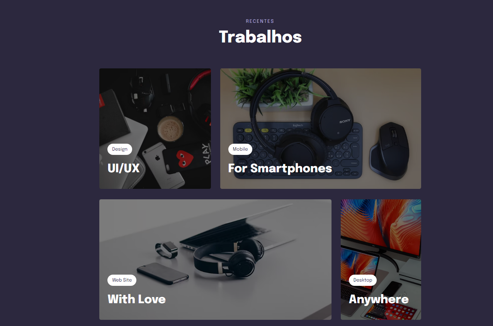

# Projeto05 do curso Explorer da Rocketseat

    
    
    

Este projeto é um componente de trabalhos que exibe diferentes categorias de trabalhos, como Design UI/UX, Mobile, Web Site e Desktop, cada um com uma imagem correspondente.

## :exclamation: Pré-requisitos

Navegador web moderno

## :hammer: Intalação

1. Clone o repositório: git clone https://github.com/Raissa-Cardoso/XR-Projeto05.git
2. Abra o arquivo `index.html` em seu navegador web.

## :computer: Uso

Após abrir o arquivo `index.html` em seu navegador, você verá um componente de trabalhos que exibe diferentes categorias de trabalhos com imagens correspondentes.

## :star: Tecnologias utilizadas

- **`HTML`**
- **`CSS`**
